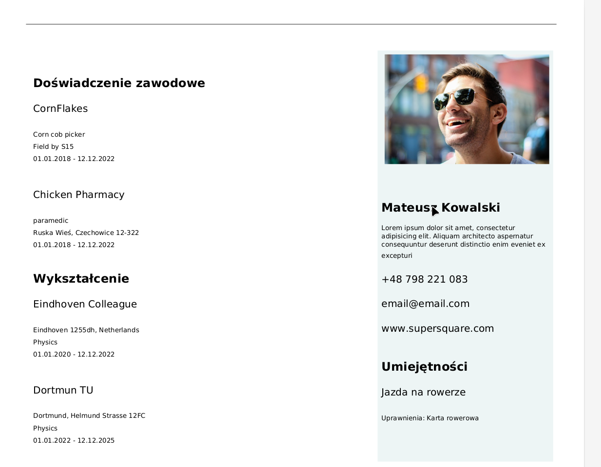
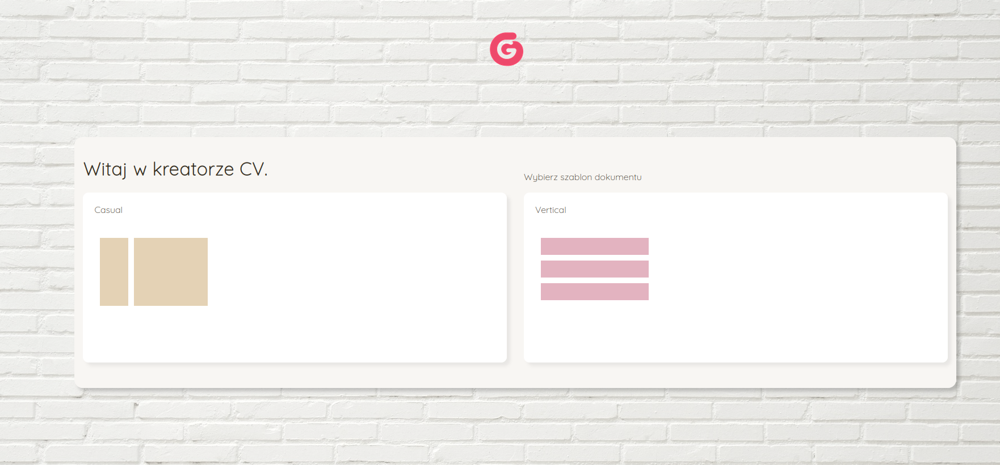

## :floppy_disk: :office: CV Generator
```
[Laravel, Vue]
```
:paperclip: This application generates a CV in PDF format using the completed data and the selected template.

## TO RUN
```
$ composer install
$ composer update
$ php artisan serve
```
## VUE
```
You can run vue separately. Proxy has been set, so application can be used from Vue environment (default 8080, laravel api proxy set for 8000 as /api/)
```

